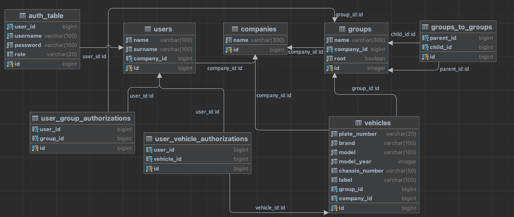

# Vehicle Tracking System

This project was developed for the purpose of learning Microservice Architecture

## Project Objective
Users with the CompanyAdmin role have powers such as registering vehicles to the system, authorizing the user to the vehicle, and grouping vehicles. Users in the standard role have authority only over the groups they are authorized for or the tools they are directly authorized for. In addition, it was requested to develop a service that returns the vehicles authorized by the users in a grouped tree structure.

## Technologies Used

- Spring Boot
- Spring Data JPA
- Hibernate
- Spring Cloud Gateway
- Spring Cloud OpenFeign
- Netflix Eureka Server
- MySQL
- Lombok
- MapStruct
- Swagger

## Database Schema

## Microservice Architecture

Microservices architecture includes various components that work together to achieve the goals of the project.

**Authentication :** Requests made to the application via api-gateway are directed to the auth-service and authenticated before being directed to the relevant service. Then, the relevant request is directed to other services within the request header in a format as follows.

{ "userId":1547, "name":"Soban", "surname":"Jawaid", "companyId":5879, "companyName":"UBER", "role":"Admin"}

**Controller :** It handles incoming HTTP requests and interacts with the service layer.

**Service :** It contains business logic, performs transactions in the database, and enforces authorization rules.

**Repository :** Spring Data provides data access using JPA.

**DTOs (Data Transfer Objects) :** It is used for data transfer between layers and external clients.

***Note :*** *Reference has been taken from Ahmet Erdoğan.*
